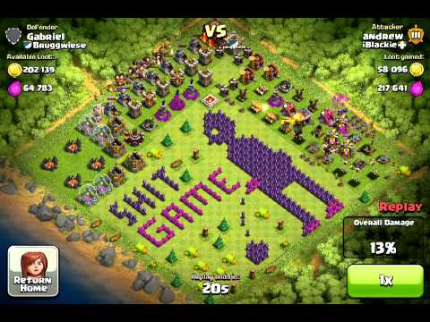
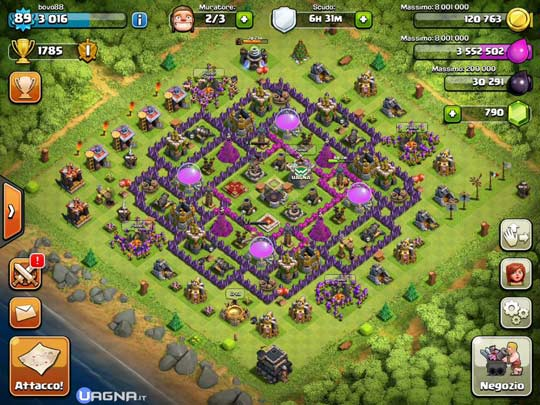
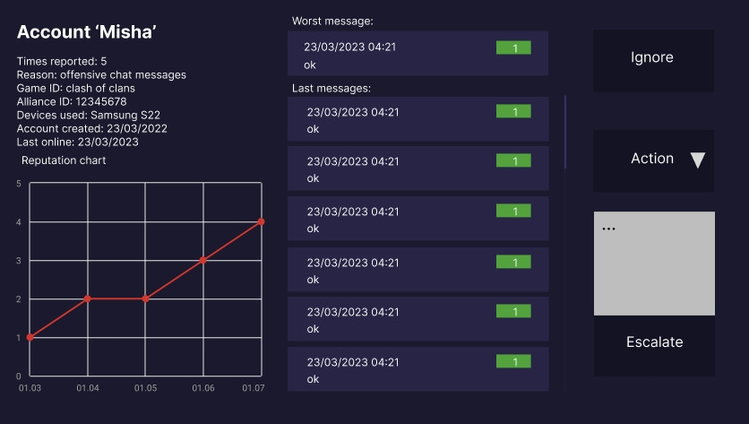
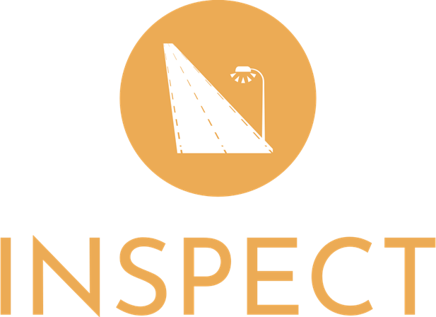

# StartHack SUPERCELL CHALLENGE      by Inspect

This is the repo for the StartHack event, this time the successful team Inspect took the SUPERCELL challenge.

## First Principle Thinking: the m**otivation behind our approach**

In an ideal world, when a cyberbullying event occurs, either the **targeted** **person** or a **witness** will **alert a moderator** through some sort of reporting. But in the real world, a player could be targeted in such a way that they feel threatened and isolated, other times they may not understand the insidious nature of the disruptive behaviour. In both cases, it’s **unlikely** that the behaviour will be **reported**.

In the digital space, we have **plenty of signals**, but trying to make sense of the signals is the challenge. There are dozens of companies out there promising that **AI can solve this, but we’re not there yet**!

It is **challenging to address this problem**, because it is **not solvable** in a technical fashion **yet**: ML models are not able to extract some meaningful information from these digital signals. This is due to the fact that the Signal-to-Noise ratio (STN) is too low, and it’s hard for a model to extract patterns from this huge amount of unstructured data. An additional factor that makes things even more complicated is the chat system that only works in groups. It’s hard to understand the destination user of the message, and there is not the possibility to create a social network based on the messages for our analysis. That said, we need to find the best possible solution to address this challenge.

The principal problems identified are multiple:

- User not reporting abusing behaviours. Objective 1: **Increase reporting fluidity**.
- User willing to abuse other users. A reinforcement loop of this behaviour comes from the fact that it’s hard to identify their abusive behaviour. Objective 2: **Reduce users’ propensity to abuse other users.**
- AI models alone are not enough. Objective 3: **Utilitze AI as a supporting tool**, but not as a unique solution.
- The need of moderators. Being a limited resource in their quantity and time at disposition, they represent the main bottleneck, for a good system of cyberthreats detection. In an Ideal world, the number of moderation is infinite, and they can process any single chat of the game, to create an accurate detection system. This is clearly an illusion. Objective 4: **Support Moderators in their Job, reduce the number of wrong reports, and increase their efficiency and accuracy.**

With these ideas in mind, we propose a new Framework for the cyberbullying detection, that we believe is a significant improvement of the existing System. In the following, we first describe theoretically the framework in it’s various aspects, and for each aspect we later present some example of our implementation as an attempt to implement the framework. The Framework is composed of three principal building Blocks:

- **Automation** as a supporting tool: As previously stated, **automation alone does not solve this challenge**, nevertheless it is fundamental as a support for the whole system. Except for voluntary user reports, **automation is the only** other **way to analyze chat content** in groups. For this reason, it is essential to use it to achieve the four set objectives. We can use automation in many ways and later we will show our implementations to try to **achieve goals 1, 2, 3 and 4**.
- **Rewarding** systems as an engine of good behaviours; Gamification strategy: The current systems are based on a punitive system. The main idea is to punish abusive behaviours by banning users when they are reported. **We strongly believe that reward is more efficient than punishment**. We believe so because the effects of punishing occur only after the malicious behaviour has happened, and there is not a change in the condition prior to the malicious act. In addition, the abusive user can always hope that he will not get caught, and that is also problematic. Rewarding systems are not perfect, but they provide additional benefits:
    - If a user is rewarded for reporting a bulling activity, he will have an interest in doing it, even if the bullied party is unknown
    - The abuser, before committing an offensive action, benefits the rewards of his good actions, and therefore is like if he accumulated an asset that he risks losing, once he get’s reported. The chances of a third party reporting him are higher.
    
    There are several studies confirming our thesis. We will therefore need to make use of in game resources to implement a rewarding system. Superficially, a possible drawback of the reporting rewarding system could be an augmentation of the number of fake reports. This is not the case in practice, if the Rewarding system is implemented carefully. We will show our implementations to try to **achieve goals 1, 2 and 4**.
    

In the next section, we provide an introduction of how the Framework can be implemented in the reality. Our solutions are an example of a good way to **start** implementing the Framework in the real world. However, our implementation does not allow to fully satisfy the Objectives presented, only allow to make some big steps towards achieving them.

## **Automation In practice**

Description of the two models, (Details of the model architecture also !!!, Cite papers =) )

Here we present our automation implementation. The automation is used for two different systems:

- A **[Visual transformer](https://arxiv.org/pdf/2010.11929.pdf)** [model](https://huggingface.co/ogimgio/start-hack-supercell) performing binary classification on the immages of the user villages. The task that the model is solving is to identify some villages that are offensive. We created a dataset by looking for images online and manually labelled them.  We created the dataset ourselves, and due to the amount of time required, we were limited to about 230 imagesm, that you can find [here](https://huggingface.co/datasets/ogimgio/starthack-supercell-dataset). Despite the small dataset, the model already shows significant learning, with a significant accuracy out-of-sample. For this reason, we believe that a sligth improvement of this model could be used to generate automated reports. We chose a VT model over a Convolutional Neural Network because it was working better in practice.

**Villages Classification: OFFENSIVE vs. NOT_OFFENSIVE**

- A **[Roberta](https://arxiv.org/pdf/1907.11692.pdf)** [model](https://huggingface.co/cardiffnlp/twitter-roberta-base-offensive) for binary classification of text messages between OFFENSIVE vs. NOT_OFFENSIVE classes. The model choosen was pretrained on a similar task on tweets, and fine-tuned on the dataset provided for the challenge. This model is not intended to be the best possible trainable model, we are sure that the current models of SUPERCELL are performing much better. The idea was to show how a model like this can be used to reach the Objectives 1 and 2. This is done using a pop-up strategy. The basic idea is that, when the model detects an offensive message, a pop-up will inform the sender that the message has been detected as offensive, and ask for a confirmation of the willingness to send the message. When the reciever recieves an offensive message, a pop-up ask the reciever if he wants to report the message.
- An automated analysis tool is created to help the moderator understand better and faster if the reported player needs to be banned. Instead of having only the last 15 messages, we use this tool to visualize the information better. To do so,

All this functionalities are presented in the Demo in our web page: [link](https://ogimgio-start-hack-23-supercell.streamlit.app)

The GitHub page where we provide all the code is [here](https://github.com/ogimgio/START-HACK-23-SUPERCELL)

## Our **Reputation system (= Rewarding)**

Supercell’s goal is to create games that are enjoyed by as many people as possible for years to come. The community of loyal players is a key foundation of their games, with many players forming friendships and communities around them. To encourage healthy communities and good behavior both online and in real life, we propose implementing a reputation system that rewards good behavior and discourages destructive behavior.

The reputation system would consist of multiple ranks, with a player’s reputation score starting at a low level when they first begin playing a game. As they continue to play, their score gradually increases. However, if a player’s actions are not in line with the community guidelines, their score decreases. Different types of inappropriate behavior impact the score.

Successful reporting by players will increase their reputation score slightly, while false reporting will decrease it if there are repeated false reports. We will provide feedback on reports to encourage players to report accurately.

Players who engage in bad behavior will receive warnings and an explanation of what they did wrong. If they continue to engage in bad behavior or their actions are too harmful for the community, their case will be sent to a moderator who can carry out a ban.

Players with the highest reputation levels who are active members of the community can become trusted players. Trusted players have access to communication channels with developers and have access to exclusive experiences as well as can organize official local events.

We prioritize players with high reputation scores and who are active members of the community in getting support and processing their requests and proposals. They can also receive in-game prizes and features as a reward for their positive behavior. (eg: gems)

A tribunal of the top N trusted community members will be established to review report cases. Each case will be randomly assigned to k players, who will decide on the appropriate action or refer the case to a moderator by majority vote. 

The tribunal as well as the moderators will also have access to charts with recent reputation data of the player, which will help with the decision-making process.

